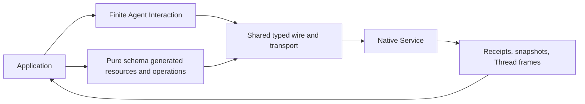

# Python SDK Architecture

## Design Position

The Python SDK provides language-native, async-first access to the public Native Service. Its authored primary workflow is a finite Agent interaction; generated typed request/response models and pure schema resource navigation retain the complete pinned HTTP contract as an advanced layer. Both use the same wire implementation, transport, authentication, and resource lifetime. The SDK never executes Agents locally, chooses a current Thread, or owns an application workflow.

The [specification index](README.md#authority) defines upstream authority. This document owns architecture and responsibility boundaries, not wire schemas.

## Boundaries

| Layer       | Owns                                                                                          | Does not own                                                         |
| ----------- | --------------------------------------------------------------------------------------------- | -------------------------------------------------------------------- |
| Application | Credentials, applied checkpoints, client-tool answers, business completion                    | Service authorization or durable Run state                           |
| Python SDK  | Agent interactions, bound references, typed results, finite observation, generated operations | Scheduling, retrying uncertain mutations, or automatic tool handlers |
| Service     | Authorization, inbox ordering, Run attempts, durable state and retained items                 | Application checkpoints or external side-effect reconciliation       |

Generation and ordinary package use require pinned SDK contract inputs, not a Service source checkout. [Resources and Client Lifetime](01-resources-and-client-lifetime.md) owns binding and transport; [Interaction and Control](02-interaction-and-control.md) owns finite interaction and commands; [Observation and Data Access](03-observation-and-data-access.md) owns stream/readback; [Resource Management](04-resource-management.md) owns management families; [Protocol and Compatibility](05-protocol-and-compatibility.md) owns wire fidelity and errors.

## Submission and Observation

1. The application binds an Agent by ID and calls `Agent.start(input, idempotency_key=...)` or `Agent.send(thread_id, input, idempotency_key=...)`.
2. The Service returns a Thread, Entry and optional immediately accepted Run. The returned `Interaction` exposes that receipt and can independently await its result or, within a local context, iterate provisional frames.
3. The SDK waits for the Entry to become `consumed`, then identifies the exact incorporating Run. An assigned or queued Entry alone does not establish incorporation.
4. Finite iteration filters another Run's Thread-wide frames and ends at this Run's seal, even when SSE is idle. Run/Item readback remains authoritative; replay availability and gaps do not guarantee a complete transcript.
5. The application explicitly interrupts, resumes or forks where authorized; local cleanup does not mutate Service execution.

| Evidence                        | Proves                                        | Does not prove                                          |
| ------------------------------- | --------------------------------------------- | ------------------------------------------------------- |
| Interaction receipt with Run    | Immediate Run acceptance for the Entry        | Entry incorporation or Run completion                   |
| Interaction receipt without Run | Entry retained in inbox                       | A Run exists for this input                             |
| `delta`/`boundary` frame        | Provisional event for the incorporating Run   | A complete transcript or durable application checkpoint |
| `gap`/`reset` frame             | Need for Run Item readback                    | Missing output recovered automatically                  |
| Sealed Run and Item readback    | Service-reported status and committed display | External side effects or business completion            |

A connection closing is not a terminal Run, and a failed mutation response is not proof of rollback.
