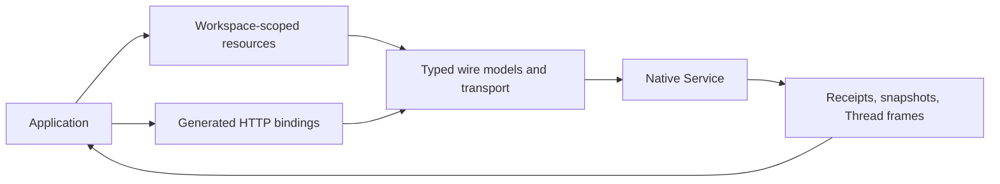

# Python SDK Architecture

## Design Position

The Python SDK provides language-native, async-first access to the public Native Service. Its resource tree binds explicit Workspace-scoped identities; generated request and response models retain the pinned HTTP contract. The SDK does not execute Agents locally, choose a current Thread, or own application workflows.

The [specification index](README.md#authority) defines upstream authority. This document owns architecture and responsibility boundaries, not wire schemas.

## Boundaries

| Layer       | Owns                                                                                           | Does not own                                                         |
| ----------- | ---------------------------------------------------------------------------------------------- | -------------------------------------------------------------------- |
| Application | Credentials, intent, applied checkpoints, client-tool answers, business completion             | Service authorization or durable Run state                           |
| Python SDK  | Bound resource references, one-request operations, typed results, bounded waits and Thread SSE | Scheduling, retrying uncertain mutations, or automatic tool handlers |
| Service     | Authorization, inbox ordering, Run attempts, durable state, retained items                     | Application checkpoints or external side-effect reconciliation       |

Generation and ordinary package use require the SDK's own pinned inputs, not a Service source checkout. [Resources and Client Lifetime](01-resources-and-client-lifetime.md) owns bindings and transport; [Interaction and Control](02-interaction-and-control.md) owns submissions and Run commands; [Observation and Data Access](03-observation-and-data-access.md) owns readback and streaming; [Resource Management](04-resource-management.md) owns management families; [Protocol and Compatibility](05-protocol-and-compatibility.md) owns wire fidelity and errors.

## Submission and Observation

1. The application submits through `Workspace.start` or `Thread.submit`, supplying an Agent ID and idempotency key.
2. The Service returns a Thread and inbox Entry, and a Run only if it accepted one immediately.
3. The application observes its exact Run or waits for the Entry's `assigned_run_id`, then binds the corresponding Workspace Run.
4. The application may attach to the Thread SSE tail; its cursors are observation progress, not application commits.
5. The application uses exact Run/Item reads for durable state and explicit commands for interrupt, resume, or fork.

| Evidence                             | Proves                                                | Does not prove                               |
| ------------------------------------ | ----------------------------------------------------- | -------------------------------------------- |
| `Submitted` with a Run               | Run accepted for this Entry                           | Run completed                                |
| `Submitted` without a Run            | Entry retained in inbox                               | A Run exists for this input                  |
| Thread `delta`/`boundary` frame      | Ordered provisional stream event at its ID            | A persisted application checkpoint           |
| Thread `changed`/`reset`/`gap` frame | State changed or reconciliation required              | An event ID or exact replay                  |
| Run read and Item readback           | Service-reported status and retained display snapshot | External side effects or business completion |

The SDK never equates a connection closing with a terminal Run, nor turns a failed mutation response into proof of rollback.
