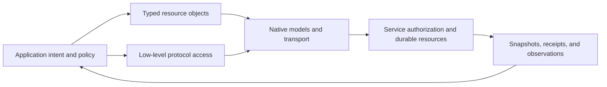

# Python SDK Architecture

## Design Position

The Python SDK provides language-native access to the public Native Service boundary. Typed resource objects carry operations on existing Service resources, while low-level bindings retain precise protocol access.

The [specification index](README.md#authority) defines upstream authority. This document owns architecture and responsibility boundaries, not individual method signatures or wire schemas.

## Boundaries

| Layer                     | Owns                                                                                                         | Does not own                                         |
| ------------------------- | ------------------------------------------------------------------------------------------------------------ | ---------------------------------------------------- |
| Application               | Explicit intent, credentials, orchestration, external handlers, applied checkpoints, and business completion | Service authorization or durable Run state           |
| Python resource interface | Local identity bindings, typed operations, bounded convenience, and response evidence                        | A second resource hierarchy or workflow lifecycle    |
| Protocol client           | Request serialization, transport lifetime, typed responses, and observation framing                          | Service defaults, execution, or permission decisions |
| Service                   | Resource authorization, durable acceptance, scheduling, execution, and retained outcomes                     | Application-local checkpoints or business completion |

Dependency direction is one-way: applications consume the SDK, and the SDK consumes public Service protocols. Development, generation, and ordinary package use require no Service source checkout or another SDK implementation.

## Architecture

- [Resources and Client Lifetime](01-resources-and-client-lifetime.md) owns shared local configuration and transport ownership.
- [Interaction and Control](02-interaction-and-control.md) owns bounded managed-Agent helpers.
- [Observation and Data Access](03-observation-and-data-access.md) owns streaming and read iteration.
- [Resource Management](04-resource-management.md) owns coverage of management domains.
- [Protocol and Compatibility](05-protocol-and-compatibility.md) owns wire fidelity and error behavior.

## End-to-End Flow

1. The application creates a Client with an explicit Service endpoint and public, Bearer, or cookie-session authentication mode.
2. It binds a Workspace, Agent, Thread, Run, or another resource without network I/O.
3. An explicit async method performs a read or command under current Service authorization.
4. A submission returns the actual Run acceptance or queued-submission disposition.
5. The application observes a particular accepted Run or queue entry through its own reference.
6. Further feedback, control, or continuation is an explicit command, not a side effect of observation.
7. Closing the Client releases local work without changing durable Service resources.

One Agent reference can serve independent Threads and concurrent calls. Reuse does not implicitly share conversation state.

## Independent Completion Boundaries

| Evidence                        | Establishes                                           | Does not establish                                |
| ------------------------------- | ----------------------------------------------------- | ------------------------------------------------- |
| Asset or Skill publication      | A resource was published                              | A Run was accepted                                |
| Queued-submission receipt       | Input was queued                                      | A Run exists for that input                       |
| Run acceptance                  | One Run was durably accepted                          | Successful execution or business completion       |
| Sealed Run snapshot             | That exact Run reached its reported sealed state      | Successor completion or display finalization      |
| Mount receipt                   | A mount request reached its reported acceptance state | Application by the current RunAttempt             |
| Connection authorization result | Authorization reached its reported outcome            | Connection readiness or a successful check        |
| Telemetry or notification       | An observation was delivered                          | A durable transition or complete usage settlement |

## Trade-offs

- Resource objects remove repeated protocol assembly without hiding which Service identity an operation targets.
- Bounded helpers reduce repetitive polling and framing; the application retains cross-Run policy and durable checkpoints.
- Low-level access remains available when a convenience method is inappropriate, without defining another credential or protocol boundary.

## Invariants

1. The SDK creates no durable identity beyond the Service resources represented by its protocol.
2. Local binding and object reuse perform no implicit submission.
3. A receipt or observation is not promoted into a stronger completion claim.
4. Resource and low-level calls can share one explicit Client lifetime.
5. The application remains the owner of workflow policy and business completion.
