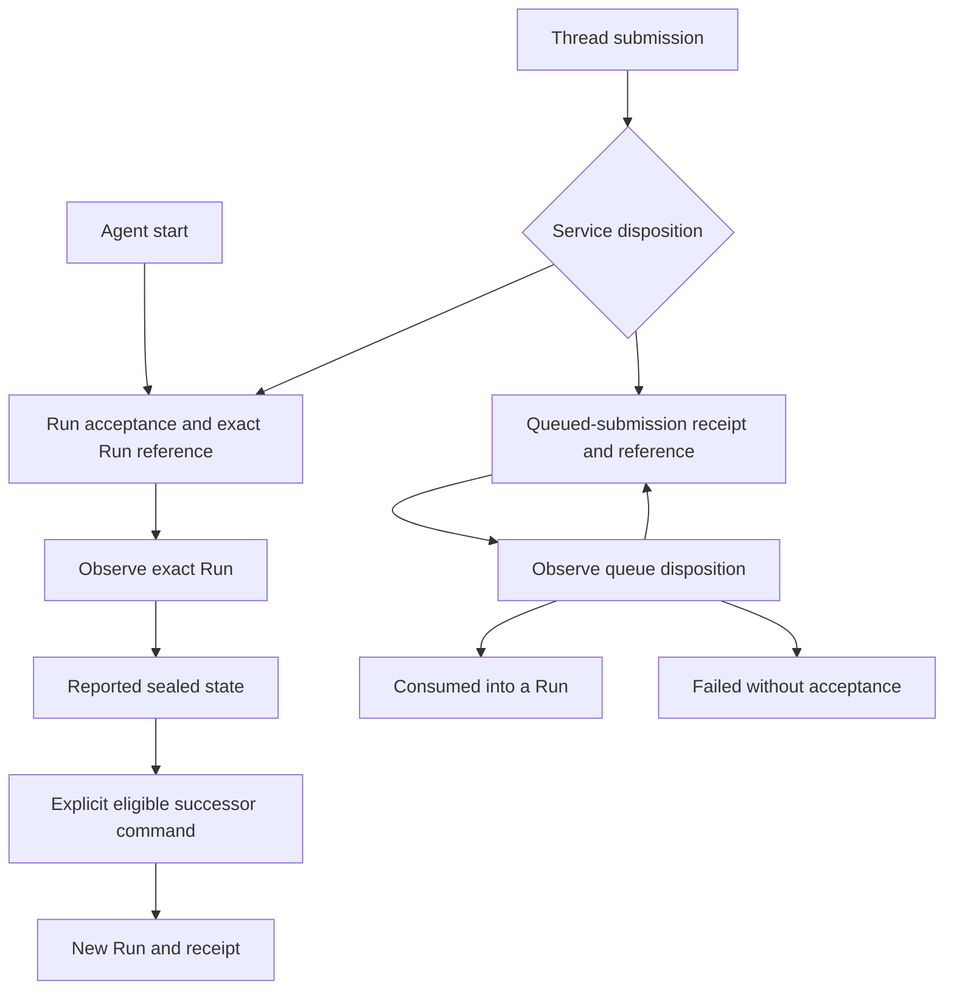

# Interaction and Control

## Design Position

Managed-Agent helpers operate on existing Service resources and preserve the actual acceptance result. They reduce repetitive protocol work without introducing a business-interaction identity or an automatic execution loop.

The [resource model](01-resources-and-client-lifetime.md#resource-roles) owns references. Service owns legal transitions and authorization; [Protocol and Compatibility](05-protocol-and-compatibility.md) owns mutation preconditions and unknown outcomes.

## Input and Agent Selection

- `Agent.start` accepts text or the complete versioned `AgentInput`.
- Text convenience constructs an ordinary text content block; it does not define another input protocol or conflate text with structured content.
- Asset references, binary acquisition, and local file paths retain their explicit meanings. A local path is not silently interpreted as a remote Environment path.
- Agent revision selection, execution overrides, Environment selection, labels, and idempotency keys are separate inputs.
- A key or mutable Agent selection does not prove which immutable revision executed. Service-reported acceptance and retained Run provenance are authoritative.
- Ordinary AgentRevision provenance and configuration-assistant provenance remain distinct under [Resource Management](04-resource-management.md#configuration-assistant).

### Python Call Shape

- The primary input is positional; selection, concurrency, idempotency, and execution options are keyword-only, with statically declared types rather than an untyped options dictionary.
- `Agent.start(input, *, idempotency_key, ...)` submits to the bound Agent without storing a current Thread. Concurrent calls do not share an implicit conversation.
- `Thread.submit(input, *, expected_thread_version, idempotency_key, ...)` addresses one continuing history. The caller obtains its version from an explicit read or prior receipt; the SDK does not read-and-retry to hide a conflict.
- `UNSET`, `None`, and a supplied Environment choice retain their distinct meanings. Optional helper arguments preserve omission instead of filling in server defaults.
- The complete typed request surface remains accessible. A convenience helper and a full-body operation share wire semantics, not conflicting sources for the same field.

The ellipses above stand for the pinned operation's remaining typed options, not `**kwargs` or a new request format.

## Submission Flow



Arrows from queue observation describe reported state changes, not actions performed by observation. Withdrawal remains a separate explicit command.

### Start

1. The caller binds an Agent and supplies explicit input and selection options.
2. Service resolves and authorizes the selection, then accepts a Run and its Thread/Session relationship.
3. The helper returns the accepted Run reference with its acceptance evidence.
4. Session creation or reuse follows the request and receipt; the helper does not infer a new Session solely from a new Run.

Creating an empty Thread is a separate collection operation, not an implicit prerequisite hidden in a Run reference.

### Thread Submission

`Thread.submit` preserves both the typed receipt and its matching resource:

| Service disposition | Result                                     | Meaning                                                 |
| ------------------- | ------------------------------------------ | ------------------------------------------------------- |
| Run accepted        | Acceptance receipt and exact Run reference | A Run exists with the reported identifiers and versions |
| Queued              | Queued-submission receipt and reference    | Editable intent exists, but no Run is implied           |

The SDK does not turn a queue-entry ID into a Run ID, flatten away queue-version evidence, or claim execution from a submission receipt.

### Acceptance Values

Acceptance helpers return read-only, discriminated Python values. The conceptual types below are SDK values, not replacement wire schemas:

```python
class RunAccepted[ReceiptT]:
    outcome: Literal["run_accepted"]
    run: Run
    thread: Thread
    session: Session
    receipt: Result[ReceiptT]


class SubmissionQueued:
    outcome: Literal["queued"]
    queued_submission: QueuedSubmission
    thread: Thread
    receipt: Result[ThreadRunSubmissionReceipt]


type ThreadSubmission = RunAccepted[ThreadRunSubmissionReceipt] | SubmissionQueued
```

- `Agent.start` returns `RunAccepted[RunAcceptanceReceipt]`; explicit feedback, retry, continue, and fork helpers return the same acceptance shape with their new identities.
- `Thread.submit` returns `ThreadSubmission`. `isinstance(result, RunAccepted)` and pattern matching narrow the branch; callers never test whether an optional Run happens to be present.
- `receipt` retains the complete operation-specific response, including queue versions and outer disposition. It is not replaced with just a nested Run acceptance.
- References are derived locally from the validated receipt, without follow-up reads. Missing or contradictory identifiers/dispositions are a `ProtocolError`, not a partly usable success.
- The Run wrapper is not a proxy: use `accepted.run.stream()` rather than implicit forwarding such as `accepted.stream()`.

### Queue Operations

- Reading or waiting observes one queue entry and never consumes it.
- Explicit consumption is a mutation on the Thread's queue.
- Editing, reordering, and withdrawal retain their required version preconditions; Thread `version` and `queue_version` are different axes.
- Consumption exposes the accepted Run or the actual non-consumption outcome, including a `submission_failed` receipt.
- A consumed disposition preserves the actual Run ID; a failed disposition does not fabricate one.
- Withdrawal or retention removal can make a subsequent read fail with the Service's not-found result; waiting does not invent a retained withdrawal snapshot.

The Python queue surface keeps entry and queue operations separate:

| Object and operation                                    | Return                                                     | Boundary                                                    |
| ------------------------------------------------------- | ---------------------------------------------------------- | ----------------------------------------------------------- |
| `QueuedSubmission.get()`                                | `Result` of the generated queued-submission representation | One exact entry                                             |
| `QueuedSubmission.wait(timeout=..., poll_interval=...)` | The terminal-disposition `Result` (`consumed` or `failed`) | Never waits for the consumed Run to finish                  |
| `QueuedSubmission.update(...)` / `delete(...)`          | Declared mutation receipt / `Result[None]`                 | Explicit entry version and idempotency key                  |
| `Thread.queued_submissions.reorder(...)`                | Declared queue receipt                                     | Explicit queue generation                                   |
| `Thread.queued_submissions.consume(...)`                | `Result[QueuedSubmissionConsumptionReceipt]`               | Selects the first eligible entry, not an arbitrary entry ID |

Queue wait uses the same explicit finite timeout and positive polling interval rules as Run wait. Its result is not another submission wrapper. A consumed Run can be bound from the returned `consumed_run_id` without fetching it; `failed` and not-found never yield a fabricated Run. Consumption retains `run_accepted` versus `submission_failed`, including their different HTTP statuses, before any explicit binding of the nested acceptance.

The [pinned queued-submission semantics](../contract/semantics/queued-submissions.md) own eligibility and consumption rules.

## Exact-Run Waiting

- `await Run.wait(*, timeout: float, poll_interval: float)` returns `Result[RunResource]` from a fresh read of the bound Run, not a stream-derived synthetic result.
- The timeout and polling interval are explicit, finite, positive seconds. The whole operation, including requests and sleeps, is bounded by that timeout; it does not restart a deadline on each poll.
- `Run.wait` polls the bound Run only and performs no speculative prefetch or automatic retry of failed reads.
- It stops on a known sealed state: completed, failed, cancelled, or waiting for feedback.
- Waiting for feedback is sealed, not an invitation to execute a client handler automatically.
- Unknown Run status strings remain visible and do not count as successful completion.
- A wait timeout or caller cancellation is local; it does not interrupt the Run or start another one.
- Sealing is distinct from Item display finalization under [Observation and Data Access](03-observation-and-data-access.md#item-snapshot-reconciliation).

### Result and Pending Data

- Completed, failed, cancelled, and waiting snapshots are all normal returns from `wait`; callers branch on `result.value.status`. API failure, protocol failure, and local timeout remain errors.
- `get` and `wait` preserve `output`, `output_text`, `pending`, and `failure` exactly as declared. The pinned output and pending fields are nullable JSON, not a promise of `Run[OutputT]` or a universal tool-result union.
- `run.pending_actions.list(...)` exposes the separately exported typed pending-action collection. It does not turn arbitrary pending JSON into executable client callbacks.
- There is no second `result()` method that drains events, silently waits without a bound, or treats every sealed state as successful output. Applications validate structured output explicitly after inspecting status.
- A `RunStream` delegates `wait` to its Run, but EOF and terminal-looking events never populate an authoritative cached result. The stream and Run read remain independent observations.

## Explicit Control and Successors

| Operation                      | Resource effect                                                  | SDK obligation                                                  |
| ------------------------------ | ---------------------------------------------------------------- | --------------------------------------------------------------- |
| Interrupt or steer             | Targets the exact Run under Service's control rules              | Preserve command acceptance and application evidence separately |
| Feedback                       | Resolves the required pending set and accepts a successor Run    | Return the new Run without rebinding the waiting Run            |
| Retry                          | Accepts another Run from eligible prior intent                   | Do not present it as recovery of the original RunAttempt        |
| Historical or waiting continue | Uses the explicitly selected source                              | Do not substitute the latest observed Run or Thread head        |
| Run fork                       | Creates a child Thread and its first Run in the existing Session | Preserve the child Thread and same-Session relationship         |

### Steer and Cancel

The following are conceptual public signatures; `AgentInput`, `SteerReceipt`, and `InterruptReceipt` are the pinned generated models:

```python
async def steer(self, input: str | AgentInput, *, idempotency_key: str) -> Result[SteerReceipt]: ...


async def cancel(
    self,
    *,
    expected_run_version: int,
    expected_thread_version: int,
    idempotency_key: str,
) -> Result[InterruptReceipt]: ...
```

- `Run.steer` preserves text conversion, the full receipt, `steer_id`, and `delivery_sequence`. Acceptance is durable inbox acceptance, not incorporation into a model request or a new Run.
- `run.steers(steer_id).get()` reads the exported `SteerStatus` with `pending`, `consumed`, or `superseded` evidence. The reference binds to the original accepted-against Run even if consumption occurs in its successor.
- Steer eligibility is determined by Service. In particular, an eligible waiting Run can accept input for its direct successor without resuming itself.
- `Run.cancel` is the Python convenience name for the pinned interrupt command, not an additional Service operation. The exact generated interrupt binding remains available; the resource facade does not add a second convenience alias with different semantics.
- A successful interrupt receipt reports committed durable cancellation, not merely an enqueued request. It does not prove that every model/tool process has stopped or that external side effects were rolled back.
- Both expected versions are caller-supplied. The SDK does not fetch and overwrite them, infer them from stream delivery, or treat waiting as an active interrupt target.
- `RunStream.steer` and `RunStream.cancel` forward to the bound Run with identical arguments, receipts, errors, and idempotency behavior. They are explicit mutations, not observation side effects.

### Successor Preconditions

- `Run.feedback` takes the pinned `WaitingRunFeedbackRequest` and an explicit idempotency key. Thread version and sealed-state digest remain mandatory. Omitted resolutions use Service's defined defaults, not an SDK auto-approval policy.
- `Run.retry` takes the pinned `RetryRunRequest`; it reuses eligible terminal intent without accepting replacement input, Agent selection, or execution overrides.
- `Run.continue_from` takes the pinned `ContinueRunRequest` and names the exact completed source. Waiting-default continuation instead uses `Thread.submit` with explicit `waiting_resolution`; these are not interchangeable routes.
- `Run.fork` takes the pinned `ForkRunRequest`; its acceptance provides the new child Thread and same Session. No unexported source-Thread version precondition is invented.
- All these successor commands require explicit idempotency keys. Request types preserve the pin's complete optional fields and required preconditions.

A separate Session fork is never implied by Run fork. Missing exported commands remain unavailable rather than being emulated with a different lifecycle.

Thread current Run, selected continuation head, historical ancestry, and operational RunAttempts remain distinct. Reading a Thread does not choose a new continuation source on the caller's behalf.

## Application-Owned Work

The application owns:

- tool-handler registration, execution, and side-effect reconciliation;
- approval decisions and complete feedback construction;
- cross-Run loops and business completion;
- durable orchestration and applied observation checkpoints.

Reads, waits, stream attachment, and event iteration never execute a tool, approve a request, submit feedback, or advance a Thread. The SDK does not supply a universal tool/approval workflow.

## Invariants

1. Every submission result preserves its actual Run-or-queue disposition.
2. Queue observation sends no consume command.
3. Waiting observes only the originally bound Run.
4. A successor command returns a new identity and leaves the source reference unchanged.
5. Retry and RunAttempt recovery are not interchangeable.
6. Run fork does not create a new Session implicitly.
7. Observation invokes no client tool or approval action.
