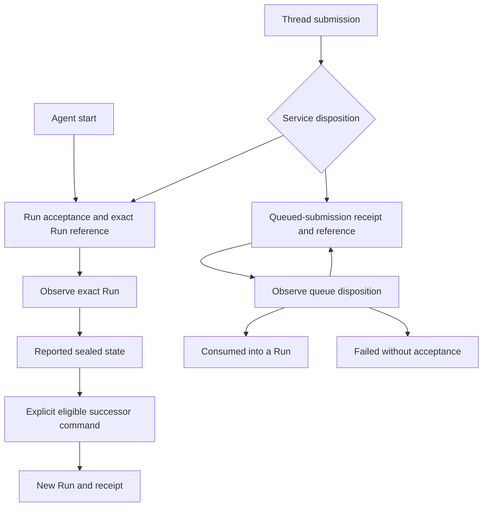

# Interaction and Control

## Design Position

Managed-Agent helpers operate on existing Service resources and preserve the actual acceptance result. They reduce repetitive protocol work without introducing a business-interaction identity or an automatic execution loop.

The [resource model](01-resources-and-client-lifetime.md#resource-roles) owns references. Service owns legal transitions and authorization; [Protocol and Compatibility](05-protocol-and-compatibility.md) owns mutation preconditions and unknown outcomes.

## Input and Agent Selection

- `Agent.start` accepts text or the complete versioned `AgentInput`.
- Text convenience constructs an ordinary text content block; it does not define another input protocol or conflate text with structured content.
- Asset references, binary acquisition, and local file paths retain their explicit meanings. A local path is not silently interpreted as a remote Environment path.
- Agent revision selection, execution overrides, Environment selection, labels, and idempotency keys are separate inputs.
- A key or mutable Agent selection does not prove which immutable revision executed. Service-reported acceptance and retained Run provenance are authoritative.
- Ordinary AgentRevision provenance and configuration-assistant provenance remain distinct under [Resource Management](04-resource-management.md#configuration-assistant).

## Submission Flow

Arrows from queue observation describe reported state changes, not actions performed by observation. Withdrawal remains a separate explicit command.

### Start

1. The caller binds an Agent and supplies explicit input and selection options.
2. Service resolves and authorizes the selection, then accepts a Run and its Thread/Session relationship.
3. The helper returns the accepted Run reference with its acceptance evidence.
4. Session creation or reuse follows the request and receipt; the helper does not infer a new Session solely from a new Run.

Creating an empty Thread is a separate collection operation, not an implicit prerequisite hidden in a Run reference.

### Thread Submission

`Thread.submit` preserves both the typed receipt and its matching resource:

| Service disposition | Result                                     | Meaning                                                 |
| ------------------- | ------------------------------------------ | ------------------------------------------------------- |
| Run accepted        | Acceptance receipt and exact Run reference | A Run exists with the reported identifiers and versions |
| Queued              | Queued-submission receipt and reference    | Editable intent exists, but no Run is implied           |

The SDK does not turn a queue-entry ID into a Run ID, flatten away queue-version evidence, or claim execution from a submission receipt.

### Queue Operations

- Reading or waiting observes one queue entry and never consumes it.
- Explicit consumption is a mutation on the Thread's queue.
- Editing, reordering, and withdrawal retain their required version preconditions; Thread `version` and `queue_version` are different axes.
- Consumption exposes the accepted Run or the actual non-consumption outcome, including a `submission_failed` receipt.
- A consumed disposition preserves the actual Run ID; a failed disposition does not fabricate one.
- Withdrawal or retention removal can make a subsequent read fail with the Service's not-found result; waiting does not invent a retained withdrawal snapshot.

The [pinned queued-submission semantics](../contract/semantics/queued-submissions.md) own eligibility and consumption rules.

## Exact-Run Waiting

- `Run.wait` polls the bound Run only, with an explicit timeout and polling interval.
- It stops on a known sealed state: completed, failed, cancelled, or waiting for feedback.
- Waiting for feedback is sealed, not an invitation to execute a client handler automatically.
- Unknown Run status strings remain visible and do not count as successful completion.
- A wait timeout or caller cancellation is local; it does not interrupt the Run or start another one.
- Sealing is distinct from Item display finalization under [Observation and Data Access](03-observation-and-data-access.md#item-snapshot-reconciliation).

## Explicit Control and Successors

| Operation                      | Resource effect                                                  | SDK obligation                                                  |
| ------------------------------ | ---------------------------------------------------------------- | --------------------------------------------------------------- |
| Interrupt or steer             | Targets the exact Run under Service's control rules              | Preserve command acceptance and application evidence separately |
| Feedback                       | Resolves the required pending set and accepts a successor Run    | Return the new Run without rebinding the waiting Run            |
| Retry                          | Accepts another Run from eligible prior intent                   | Do not present it as recovery of the original RunAttempt        |
| Historical or waiting continue | Uses the explicitly selected source                              | Do not substitute the latest observed Run or Thread head        |
| Run fork                       | Creates a child Thread and its first Run in the existing Session | Preserve the child Thread and same-Session relationship         |

A separate Session fork is never implied by Run fork. Missing exported commands remain unavailable rather than being emulated with a different lifecycle.

Thread current Run, selected continuation head, historical ancestry, and operational RunAttempts remain distinct. Reading a Thread does not choose a new continuation source on the caller's behalf.

## Application-Owned Work

The application owns:

- tool-handler registration, execution, and side-effect reconciliation;
- approval decisions and complete feedback construction;
- cross-Run loops and business completion;
- durable orchestration and applied observation checkpoints.

Read, wait, and stream methods never execute a tool, approve a request, submit feedback, or advance a Thread. The SDK does not supply a universal tool/approval workflow.

## Invariants

1. Every submission result preserves its actual Run-or-queue disposition.
2. Queue observation sends no consume command.
3. Waiting observes only the originally bound Run.
4. A successor command returns a new identity and leaves the source reference unchanged.
5. Retry and RunAttempt recovery are not interchangeable.
6. Run fork does not create a new Session implicitly.
7. Observation invokes no client tool or approval action.
